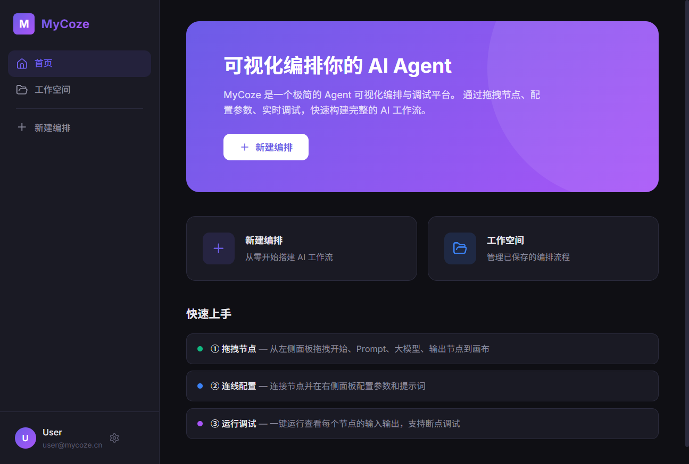

# FlowAgent —— Agent 工作流可视化编排与调试平台

> **在线体验：[https://flowagent.vercel.app](https://flowagent.vercel.app)**

面向自动化流程场景（以单 Agent 内部工作流程编排为示例），独立完成的一个支持条件分支的 Agent 工作流可视化编排与调试平台，聚焦画布交互、DAG 执行引擎、实时调试三个核心能力，涵盖编排、校验、执行、调试完整链路。

## 预览

| 首页 | 编辑器 |
|------|--------|
|  |  |

## 核心功能

### 可视化编排画布

基于 ReactFlow 封装 **6 种自定义节点**（开始 / Prompt / 大模型调用 / 条件分支 / 代码 / 输出），支持拖拽添加、连线类型白名单校验（区分条件节点 true / false 出口）、画布缩放平移；基于 `structuredClone` 全量快照 + 双栈模型实现撤销重做（300ms 防抖合并高频快照），支持 Ctrl+Z / Cmd+Z。

### DAG 执行引擎

- 基于 **Kahn 算法**拓扑排序确定执行顺序并检测环路
- 条件分支节点根据上游输出做表达式求值，运行时**动态裁剪不可达路径**，仅执行活跃分支
- 代码节点通过 `new Function` 沙箱化执行用户 JS 逻辑
- 基于 `{{变量名}}` 正则插值实现跨节点数据传递
- 通过 `await` 未决 Promise 暂停 async 执行流，实现可暂停 / 恢复的**断点调试机制**

### 全链路调试面板

运行前校验（环路检测、连通性、必填字段），运行时节点状态实时同步至画布（脉冲动画 / 成功 / 失败 / 已跳过），面板逐节点展示输入输出与耗时，条件节点展示判断结果与分支走向。

### 四层解耦架构

节点渲染层 / 画布交互层 / 状态桥接层（Context + 自定义 Hooks）/ 执行引擎层（纯逻辑，零 React 依赖，可独立单测），localStorage 持久化流程数据。

## 技术栈

JavaScript · React 19 · Vite · ReactFlow · React Router · CSS Modules · localStorage

## 项目结构

```
src/pages/Editor/
├── Editor.jsx              # 编辑器主组件，管理全局状态
├── engine/                 # 执行引擎层（纯逻辑，不依赖 React）
│   ├── FlowEngine.js       # 流程执行引擎：逐节点执行、条件裁剪、断点暂停/恢复
│   ├── topologicalSort.js  # Kahn 算法拓扑排序 + 环路检测
│   ├── validator.js        # 流程校验：连通性、必填字段、环路
│   └── llmService.js       # 大模型调用：真实 API + 模拟响应双模式
├── hooks/                  # 状态桥接层
│   ├── useFlowExecution.js # 引擎回调 → React 状态
│   └── useUndoRedo.js      # 撤销重做（快照 + 双栈）
├── nodes/                  # 自定义节点组件（Start / Prompt / LLM / Condition / Code / Output）
└── components/             # 编辑器 UI 组件（画布、配置面板、调试面板等）
```

## 本地运行

```bash
git clone git@github.com:z-stefanie/FlowAgent.git
cd FlowAgent
npm install
npm run dev
```

浏览器访问 `http://localhost:5173`，进入编辑器后拖拽节点到画布即可开始编排。

## License

MIT
